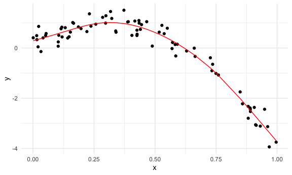
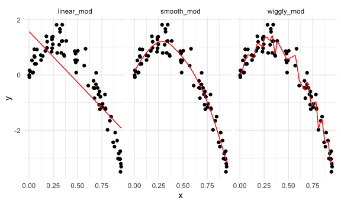
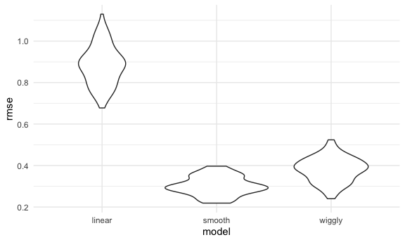

Cross Validation
================
Rachel Tao
11/22/20

## Simulate data

``` r
nonlin_df =
  tibble(
    id = 1:100,
    x = runif(100, 0, 1),
    y = 1 - 10 * (x - 0.3) ^ 2 + rnorm(100, 0, 0.3)
  )
```

``` r
nonlin_df %>% 
  ggplot(aes(x = x, y = y)) +
  geom_point()
```


## Cross validatioin – by hand

Get training and testing datasets

``` r
train_df = sample_n(nonlin_df, size = 80)
test_df = anti_join(nonlin_df, train_df, by = "id")
```

fit three models.

``` r
linear_mod = lm(y ~ x, data = train_df)
smooth_mod = gam(y ~ s(x), data = train_df)
wiggly_mod = gam(y ~ s(x, k = 30), sp = 10e-6, data = train_df)
```

can i see what I just did…

``` r
train_df %>% 
  add_predictions(smooth_mod) %>% 
  ggplot(aes(x = x, y = y)) +
  geom_point() +
  geom_line(aes(y = pred), color = "red")
```



Can look at all of these at the same time

``` r
train_df %>% 
  gather_predictions(linear_mod, smooth_mod, wiggly_mod) %>% 
  ggplot(aes(x = x, y = y)) +
  geom_point() +
  geom_line(aes(y = pred), color = "red") +
  facet_grid(. ~ model)
```



The smooth model should do best in terms of prediction accuracy, based
on the training dataset.

Look at prediction accuracy using the testing dataset.

``` r
rmse(linear_mod, test_df)
```

    ## [1] 0.8873441

``` r
rmse(smooth_mod, test_df)
```

    ## [1] 0.2746789

``` r
rmse(wiggly_mod, test_df)
```

    ## [1] 0.4854074

Since RMSE is smallest (0.30) for the smooth model, the smooth model
seems to do best.

## Cross validation using ‘modelr’

``` r
cv_df = 
  crossv_mc(nonlin_df, 100)
```

``` r
cv_df %>% pull(train) %>% .[[1]] %>% as_tibble()
```

    ## # A tibble: 79 x 3
    ##       id     x      y
    ##    <int> <dbl>  <dbl>
    ##  1     1 0.140  0.464
    ##  2     2 0.494  0.525
    ##  3     3 0.715 -0.700
    ##  4     4 0.753 -1.16 
    ##  5     5 0.791 -1.09 
    ##  6     6 0.942 -3.50 
    ##  7     7 0.725 -0.595
    ##  8     8 0.291  0.793
    ##  9     9 0.833 -1.66 
    ## 10    11 0.284  1.81 
    ## # … with 69 more rows

``` r
cv_df %>% pull(test) %>% .[[1]] %>% as_tibble()
```

    ## # A tibble: 21 x 3
    ##       id     x      y
    ##    <int> <dbl>  <dbl>
    ##  1    10 0.758 -1.05 
    ##  2    15 0.665 -0.214
    ##  3    20 0.233  0.835
    ##  4    24 0.186  0.977
    ##  5    27 0.706 -0.468
    ##  6    33 0.359  0.722
    ##  7    41 0.237  1.28 
    ##  8    43 0.916 -3.02 
    ##  9    44 0.333  0.796
    ## 10    47 0.405  0.618
    ## # … with 11 more rows

``` r
cv_df =
  cv_df %>% 
  mutate(
    train = map(train, as_tibble),
    test = map(test, as_tibble)
  )
```

Let’s try to fit models and get RMSEs for them.

``` r
cv_df = 
  cv_df %>% 
  mutate(
    linear_mod = map(.x = train, ~lm(y ~ x, data = .x)),
    smooth_mod = map(.x = train, ~gam(y ~ s(x), data = .x)),
    wiggly_mod = map(.x = train, ~gam(y ~ s(x, k = 30), sp = 10e-6, data = .x))
  ) %>% 
  mutate(
    rmse_linear = map2_dbl(.x = linear_mod, .y = test, ~rmse(model = .x, data = .y)),
    rmse_smooth = map2_dbl(.x = smooth_mod, .y = test, ~rmse(model = .x, data = .y)),
    rmse_wiggly = map2_dbl(.x = wiggly_mod, .y = test, ~rmse(model = .x, data = .y))
  )
```

What do these results say about the model choice?

``` r
cv_df %>% 
  select(starts_with("rmse")) %>% 
  pivot_longer(
    everything(),
    names_to = "model",
    values_to = "rmse",
    names_prefix = "rmse_"
  ) %>% 
  ggplot(aes(x = model, y = rmse)) +
  geom_violin()
```



Compute averages …

``` r
cv_df %>% 
  select(starts_with("rmse")) %>% 
  pivot_longer(
    everything(),
    names_to = "model",
    values_to = "rmse",
    names_prefix = "rmse_"
  ) %>% 
  group_by(model) %>% 
  summarize(avg_rmse = mean(rmse))
```

    ## `summarise()` ungrouping output (override with `.groups` argument)

    ## # A tibble: 3 x 2
    ##   model  avg_rmse
    ##   <chr>     <dbl>
    ## 1 linear    0.883
    ## 2 smooth    0.303
    ## 3 wiggly    0.381
