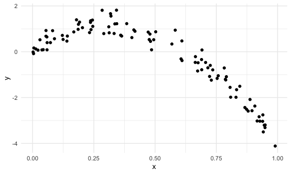
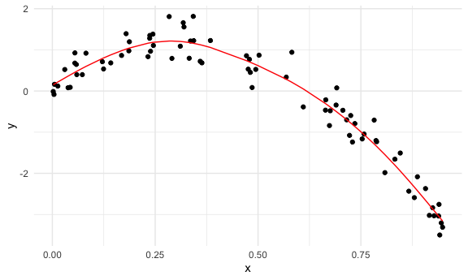

Cross Validation
================
Rachel Tao
11/22/20

## Simulate data

``` r
nonlin_df =
  tibble(
    id = 1:100,
    x = runif(100, 0, 1),
    y = 1 - 10 * (x - 0.3) ^ 2 + rnorm(100, 0, 0.3)
  )
```

``` r
nonlin_df %>% 
  ggplot(aes(x = x, y = y)) +
  geom_point()
```



## Cross validatioin – by hand

Get training and testing datasets

``` r
train_df = sample_n(nonlin_df, size = 80)
test_df = anti_join(nonlin_df, train_df, by = "id")
```

fit three models.

``` r
linear_mod = lm(y ~ x, data = train_df)
smooth_mod = gam(y ~ s(x), data = train_df)
wiggly_mod = gam(y ~ s(x, k = 30), sp = 10e-6, data = train_df)
```

can i see what I just did…

``` r
train_df %>% 
  add_predictions(smooth_mod) %>% 
  ggplot(aes(x = x, y = y)) +
  geom_point() +
  geom_line(aes(y = pred), color = "red")
```



Can look at all of these at the same time

``` r
train_df %>% 
  gather_predictions(linear_mod, smooth_mod, wiggly_mod) %>% 
  ggplot(aes(x = x, y = y)) +
  geom_point() +
  geom_line(aes(y = pred), color = "red") +
  facet_grid(. ~ model)
```


The smooth model should do best in terms of prediction accuracy, based
on the training dataset.

Look at prediction accuracy using the testing dataset.

``` r
rmse(linear_mod, test_df)
```

    ## [1] 0.7414364

``` r
rmse(smooth_mod, test_df)
```

    ## [1] 0.249897

``` r
rmse(wiggly_mod, test_df)
```

    ## [1] 0.2895661

Since RMSE is smallest (0.30) for the smooth model, the smooth model
seems to do best.
